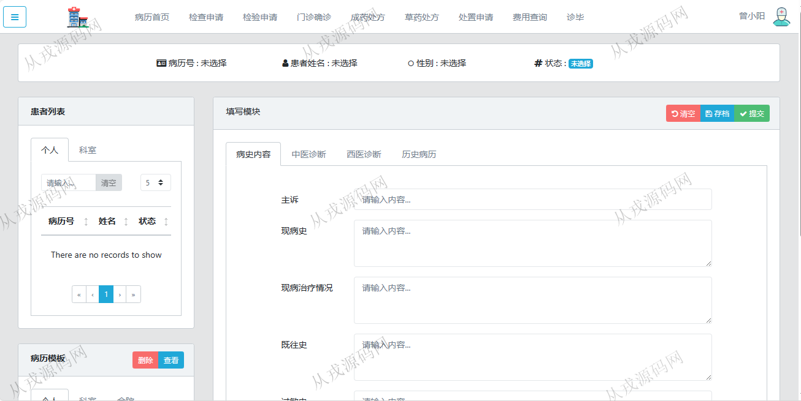
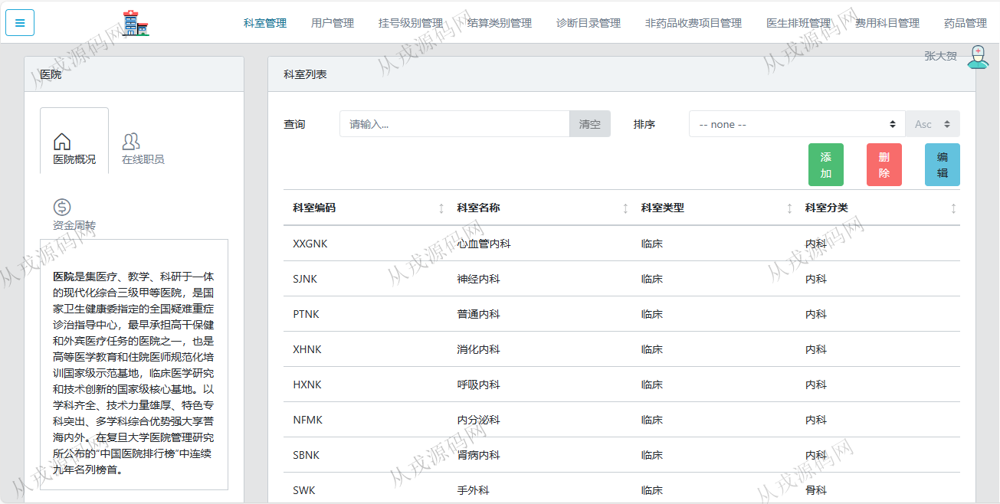
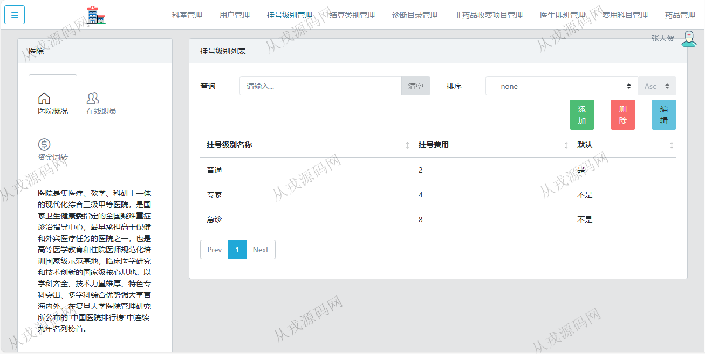
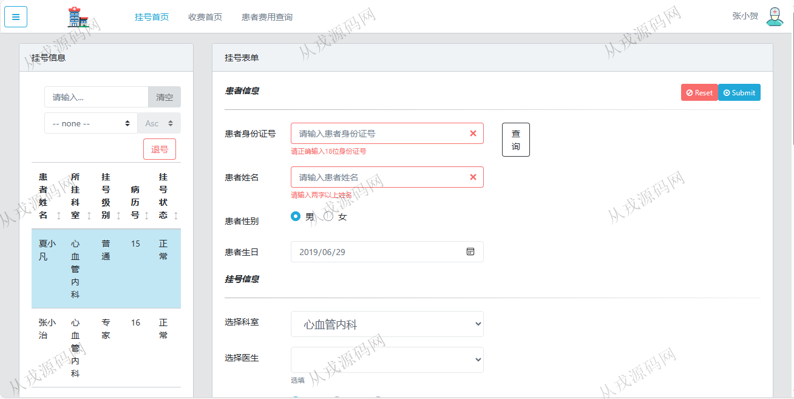
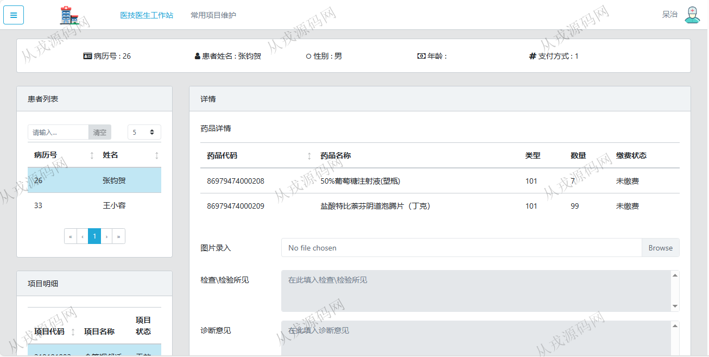
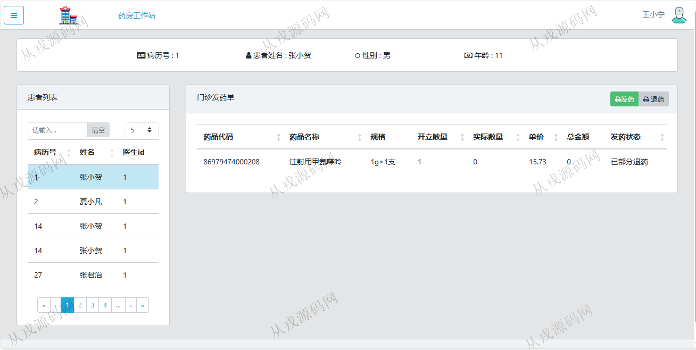
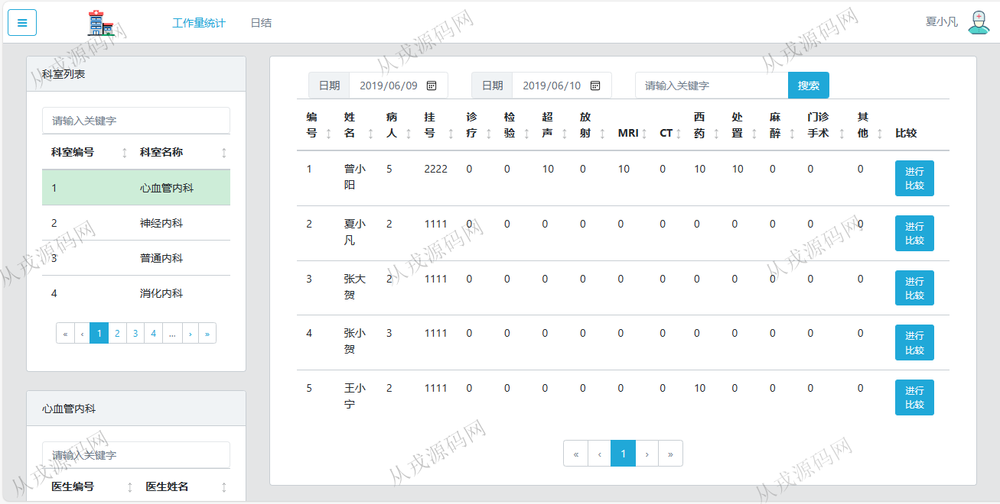
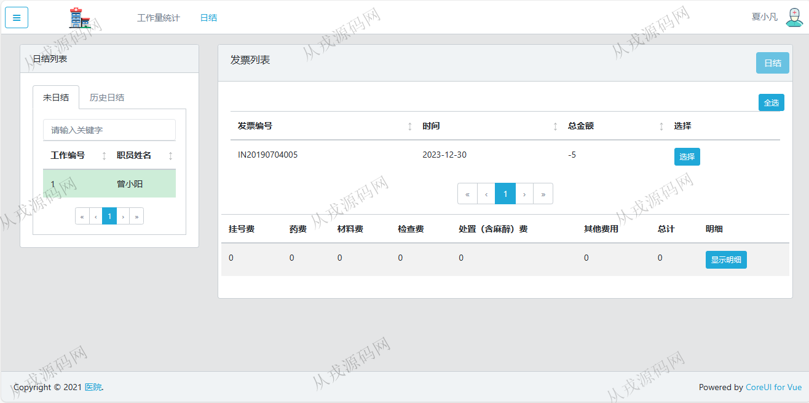

<h1 align="center">89.医院管理系统</h1>

 获取sql文件 QQ: 386869957 QQ群: 377586148 

 [推荐站点: 从戎源码网](https://armycodes.com/) 

## 简介

> 本代码来源于网络,仅供学习参考使用!
>
> 提供1.远程部署/2.修改代码/3.设计文档指导/4.框架代码讲解等服务
>  
> 登录地址：http://localhost:8000/#/login
> 
> 医生：doctor doctor
> 
> 医技医生：tech tech
> 
> 药房：pharmacy pharmacy
> 
> 挂号：register register
> 
> 工作量统计：statistics statistics
> 
> 管理员：basicInfo basicInfo
>

## 项目介绍
基于springboot+vue的医院管理系统：前端 vue、bootstrap、coreui，后端 maven、springmvc、spring、mybatis、redis，角色分为管理员、医生、医技医生、药房、挂号；集成挂号、检查申请、成药处方、处置申请等功能于一体的系统。

## 功能介绍

- 管理员：科室管理、用户管理、挂号级别管理、结算类别管理、诊断目录管理、非药品收费项目管理、医生排班管理、费用科目管理、药品管理
- 医生：病历首页、检查申请、检验申请、门诊确诊、成药处方、草药处方、处置申请、费用查询、诊毕
- 医技医生：医技医生工作站、常用项目维护
- 药房：药房工作站、发药、退药
- 挂号：挂号首页、收费首页、患者费用查询
- 工作量统计：工作量统计、日结

## 环境

- <b>IntelliJ IDEA 2021.3</b>

- <b>Mysql 5.7.26</b>

- <b>JDK 1.8</b>

- <b>node 14.14.0</b>

- <b>Redis 3.0</b>

## 运行截图

